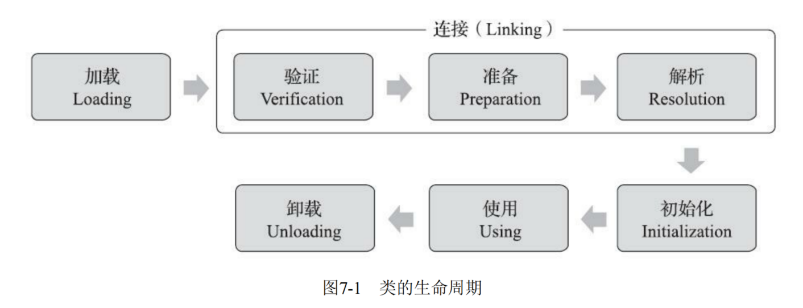

# JVM的整体架构

## JVM的架构模型

基本上是基于栈的指令集架构

1. 基于栈式架构的特点
   - 设计和实现更简单，适用于资源受限的系统
   - 避开了寄存器的分配难题：使用零地址指令方式分配
   - 指令流中的指令大部分是零地址指令，其执行过程依赖于操作栈。指令集更小，编译器容易实现
   - 不需要硬件支持，可移植性更好，更换实现跨平台
2. 基于寄存器架构的特点
   - 典型的应用是x86的二进制指令集，比如传统的PC以及Android的Davlik虚拟机
   - 指令集架构则完全依赖硬件，可移植性差
   - 性能优秀和执行更高效
   - 花费更少的指令去完成一项操作
   - 在大部分情况下，基于寄存器架构的指令集往往都以一地址指令，二地址指令和三地址指令为主，而基于栈式架构的指令集却是以零地址指令为主。

> 总结：
>
> 由于跨平台的设计，Java的 指令都是根据栈来设计的 。不同平台下CPU架构不同，所以不能设计为基于寄存器的。优点是跨平台，指令集小，编译器容易实现，缺点是性能下降，实现同样的功能需要更多的指令。

## JVM生命周期

1. 虚拟机的启动

   Java虚拟机的启动是通过引导类加载器(bootstrap class loader)创建一个初始类(initial class)来完成的，这个类是由虚拟机的具体实现指定的

2. 虚拟机的执行

   - 一个运行中的Java虚拟机有着一个清晰的任务，执行Java程序
   - 程序开始执行时他才运行，程序结束时他就停止
   - 执行一个所谓的Java程序的时候，真真正正在执行的是一个叫做Java虚拟机的进程

3. 虚拟机的退出

   - 程序正常的执行结束
   - 程序在执行过程中遇到了异常或错误而异常终止
   - 由于操作系统出现错误而导致Java虚拟机进程终止
   - 某线程调用Runtime类或System类的exit方法，或Runtime类的halt方法，并且Java安全管理器也允许这次exit或halt操作 
   - JNT(Java Native Interface)规范描述了用JNT Invocation API来加载或卸载Java虚拟机时，Java虚拟机的退出情况

# 类加载子系统

- 虚拟机的类加载

> 虚拟机把描述类的数据从Class文件加载到内存，并对数据进行校验，转换解析和初始化，最终形成可以被虚拟机直接使用的Java类型

## 类加载的时机

- 对类立即进行初始化的四种情况(主动引用)

  - 遇到new，getstatic，putstatic或invokestatic等四个指令时，如果未对齐进行初始化，则进行初始化
  - 使用java.lang.reflect进行反射调用时，还未初始化
  - 初始化时，父类未初始化，则对父类先进行初始化

  > 接口在初始化时，不会要求其父接口全部完成初始化，只有在使用到父接口时，才会进行初始化

  - 当虚拟机启动时，用户需要指定一个要执行的主类时

- 被动引用

  - 通过子类引用父类的静态字段，不会导致子类初始化
  - 通过数组定义来引用类，不会触发此类的初始化
  - 常量在编译阶段会存入调用类的常量池中，本质上没有直接引用到定义常量的类，因此不会触发定义常量的类的初始化

## 类加载的过程

类加载的全过程---加载，验证，准备，解析和初始化

1. 加载(Loading)

   - 通过一个类的全限定名获取定义此类的二进制文件流

   - 将这个字节流所代表的静态存储结构转化为方法区的运行时数据结构

   - 在内存中生成一个代表这个类的java.lang.Class对象，作为方法区这个类的各种数据的访问入口

   - > 加载.class文件的方式
     >
     > - 从本地系统中直接加载
     > - 通过网络获取，典型场景，Web Applet
     > - 从zip压缩包中读取，成为日后jar,war格式的基础
     > - 运行时计算生成，使用最多的是：动态代理技术
     > - 由其他文件生成，典型场景：JSP应用
     > - 从专有数据库中提取.class文件，比较少见
     > - 从加密文件中获取，典型的防Class文件被反编译的保护措施

2. 验证(Verify)

   - 目的在于确保Class文件的字节流中包含信息符合当前虚拟机 要求，保证被加载类的正确性，不会 危害虚拟机自身安全
   - 主要包括四种验证
     - 文件格式验证
     - 元数据验证
     - 字节码验证
     - 符号 引用验证

3. 准备(Prepare)

   - 为类变量分配内存并且设置该类变量的默认初始值
   - 不包含用final修饰的static，因为final在编译的时候就会分配，准备阶段会显式初始化
   - 不会为实例变量分配初始化，类变量会分配在方法区中，而实例变量是会随着对象一起分配到Java堆中

4. 解析(Resolve)

   - 将常量池内的符合引用转换为 直接引用的过程。
   - 解析操作往往会伴随着JVM在执行完初始化之后在执行。
   - 符号引用就是一组符号 来描述所引用的目标。直接引用就是直接指向目标的指针，相对偏移量或一个间接定位到目标的句柄。
   - 解析 动作主要针对类或接口，字段，类方法，接口方法，方法类型等。对应常量池中的CONSTANT_Class_info，CONSTANT_Fieldrer_info，CONSTANT_Methodref_info等

5. 初始化

   - 初始化阶段就是执行类构造器方法<clinit>()的过程。
   - 此方法不需要定义，是javac编译器自动收集类中的所有类变量的赋值动作和静态代码块中的语句合并而来。
   - 构造器方法中指令按语句在源文件中出现的顺序执行。
   - <clinit>()不同于类的构造器。
   - 若该类具有父类，JVM会保证子类的<clinit>()执行前，父类的<clinit>()已经执行完毕。
   - 虚拟机必须保证一个类的<clinit>()方法在多线程下被同步加锁。

## 类加载器的分类

JVM支持两种类型的类加载器，分别为引导类加载器(Bootstrap ClassLoader)和自定义类加载器(User-Defined ClassLoader)

> 从概念上讲，自定义类加载器一般指的是程序中由开发人员自定义的 一类类加载器，但是Java虚拟机规范却没有这么定义，而是将所有派生于抽象类ClassLoader的类加载器都划分为自定义类加载器

### 虚拟机自带的加载器

1. 启动类加载器(引导类加载器，BootstrapClassLoader)
   - 这个类加载使用C/C++语言实现的，嵌套在JVM内部。
   - 它用来加载Java的核心库(JAVA_HOME/jre/lib/rt.jar，resources.jar或sun.boot.class.path路径下的内容)，用于提供 JVM自身需要的类
   - 并不继承java.lang.ClassLoader，没有父加载器。
   - 加载扩展类和应用程序类加载器，并指定为他们的父类加载器。
   - 出于安全考虑，Bootstrap启动类加载器只加载包名为java，javax，sun等开头的类。
2. 扩展类加载器(Extension ClassLoader)
   - Java语言编写，由sun.misc.Launcher$ExtClassLoader实现。
   - 派生于ClassLoader类。
   - 父类加载器为启动类加载器。
   - 从java.ext.dirs系统属性所指定的目录中加载类库，或从JDK的安装目录的jre/lib/ext子目录(扩展目录)下加载类库。如果用户创建的JAR放在此目录下，也会自动由扩展类加载器加载。

3. 应用程序类加载器(系统类加载器，AppClassLoader)

   - java语言编写，由sun.misc.Launcher$AppClassLoader实现。
   - 派生于ClassLoader类。
   - 父类加载器为扩展类加载器。
   - 它负责加载环境变量classpath或系统属性java.class.path指定路径下单类库。
   - 该类加载是程序中默认的类加载器 ，一般来说，Java应用的类都是由它来完成加载。
   - 通过ClassLoader#getSystemClassLoader()方法可以获取到该类加载器。

4. 用户自定义类加载器

   > 为什么要自定义类加载器？
   >
   > - 隔离加载类
   > - 修改类加载的方式
   > - 扩展加载源
   > - 防止源码泄露

## 双亲委派机制

Java虚拟机对class文件采用的是按需加载的方式，既当需要使用该类时才会将它的class的文件加载到内存生成class对象，而且加载某个类的class文件时，Java虚拟机采用的是双亲委派模式，既把请求交由父类处理，它是一种任务委派模式。

### 工作原理

1. 如果一个加载器收到了类加载请求，它并不会自己先去加载，而是把这个请求委托给父类的加载器去执行；
2. 如果父类加载器还存在其父类加载器，则进一步向上委托，一次递归，请求最终将到达顶层的启动类加载器 ；
3. 如果父类加载器可以完成类加载任务，就成功返回，倘若父类加载器无法完成此加载任务，子加载器才会尝试自己去加载，这就是双亲委派模式

> 优势：
>
> - 避免类的重复加载
> - 保护程序安全，防止核心API被随意篡改

# 线程

- 线程是一个程序里的运行单元.JVM允许一个应用有多个线程并行的执行。
- 在HotSpot JVM里，每个线程都 与操作系统的本地线程直接映射。
  - 当一个Java线程准备好执行以后，此时一个操作系统的本地线程也同时创建 。Java线程执行终止后，本地线程也会回收。
- 操作系统负责所有线程的安排调度到任何一个可用的CPU上。一旦本地线程初始化成功，它就会调用Java线程中的run()方法。

HotSpot JVM的几个主要线程：

- 虚拟机线程
  - 这种线程的操作是需要JVM达到安全点才会出现。这些操作必须在不同的线程中发送的原因是他们都需要JVM达到安全点，这样才不会变化。这种线程的执行类型包括“stop-the-world”的垃圾收集，线程栈收集，线程挂起以及偏向锁撤销。
- 周期任务线程
  - 这种线程是时间周期事件的体现(比如中断)，他们一段用于周期性操作的调度执行。
- GC线程
  - 这种线程对在JVM里不同种类的垃圾收集行为提供了支持。
- 编译线程
  - 这种线程在运行时会将字节码编译成大片本地代码
- 信号调度线程
  - 这种线程接受信号并发送给JVM，在它内部通过调用适当的方法进行处理。